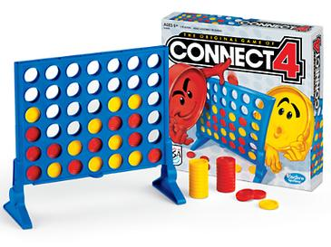

# Connect Four

Connect Four (also known as **Connect 4, Four Up, Plot Four, Find Four, Captain's Mistress, Four in a Row, Drop Four**, and **Gravitrips** in the Soviet Union)
is two-player connection board game.



### Game mechanics

The players choose a color and then **take turns** dropping colored tokens into a **seven-column, six-row vertically suspended grid**. The pieces fall straight down, occupying the lowest available space within the column. 

The **objective** of the game is **to be the first to form a horizontal, vertical, or diagonal line of four of one's own tokens**. Connect Four is a solved game. The first player can always win by playing the right moves. 

In this case player 1 wins because it managed to form an horizontal row:

    0 0 0 0 0 0 0
    0 0 0 0 0 0 0
    0 0 0 0 0 0 0
    0 0 0 0 0 0 0
    0 0 0 0 2 0 0
    1 1 1 1 2 2 0

In this example, player 2 wins after forming a diagonal row:

    0 0 0 0 0 0 0
    0 0 0 0 0 0 0
    0 0 2 0 0 0 0
    0 0 1 2 0 0 0
    0 0 2 1 2 0 0
    0 1 1 1 2 2 0


## Setup
The project is prepared for a Unix/Linux environment, but it should be possible work in Windows with some small modifications.

```sh
# Install pipenv
pip install pipenv
```

```sh
# Install dependencies
python -m pipenv install --dev
# or using the Makefile job
make install

# Setup pre-commit and pre-push hooks
python -m pipenv run pre-commit install -t pre-commit
python -m pipenv run pre-commit install -t pre-push
```

## Run the tests

```sh
python -m pipenv run pytest -v
# or using Makefile
make test
```

## Credits

[Connect Four](https://en.wikipedia.org/wiki/Connect_Four)

This package was created with Cookiecutter and the [sourcery-ai/python-best-practices-cookiecutter](https://github.com/sourcery-ai/python-best-practices-cookiecutter) project template.
